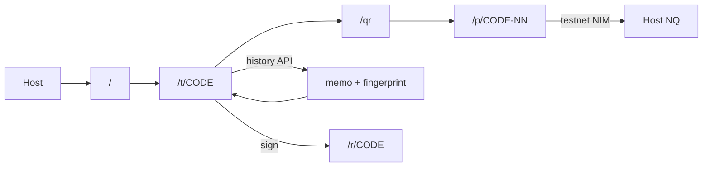

# Tab

**Split the bill. Settled at the table.**

Nimiq Pay mini app. Guests pay the host's address. Tab never holds funds. When everyone's clear, the host signs a receipt anyone can verify.

**Default network: testnet.** Set `NEXT_PUBLIC_NIMIQ_NETWORK=mainnet` for production.

## Why Nimiq

Feeless ~1s transfers. A $7 share doesn’t die to fees.

## Who

3–8 friends at dinner. Host needs Nimiq Pay; guests can pay from any NIM wallet.

## Quick start

```bash
npm install
cp .env.example .env.local   # already defaults to testnet
npm run dev
```

`http://localhost:3000`

### Testnet in Nimiq Pay

1. Long-press **Settings** for ~10 seconds → enable the hidden menu
2. Switch network to **Testnet**
3. Tap **Get free NIM** on the home / top-up screen (~110k test NIM)
4. Load the mini app (local URL or deployed)

History polling uses `v2.test.nimiqwatch.com`. Explorer links go to `test.nimiq.watch`.

Optional Supabase: `.env.example` + `supabase/schema.sql`. Else local `.data/store.json`.

Local mini app: https://nimiq.dev/mini-apps/development/load-local-mini-app

## Screens

| Route | Job |
|---|---|
| `/` | Create |
| `/t/CODE` | Board |
| `/t/CODE/qr` | QR |
| `/p/CODE-NN` | Pay |
| `/r/CODE` | Receipt |

## Architecture



Next.js · Tailwind · Supabase or JSON · nimiq.watch history · `@nimiq/mini-app-sdk` · Rive + Motion

## Limits

- Unaudited
- NIM only (no USDT yet)
- Default testnet — switch env for mainnet
- Tabs expire in 24h
- Cash marks are unverified
- Mismatch: host Keep / Undo only
- FX still uses live NIM/USD for display math; test NIM has no market value
- `.data/` is single-process — use Supabase in prod

## Roadmap

1. Ship `lib/nimiq/` as a package
2. USDT path with an honest fee
3. Bill photo → total (v2)
4. Per-dish split (v2)
5. Stamped — seller receipts from this signature module
6. Public tab counter

## Criteria

[`docs/criteria.md`](docs/criteria.md)

## License

MIT
