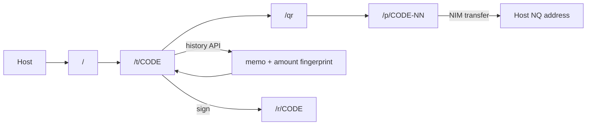
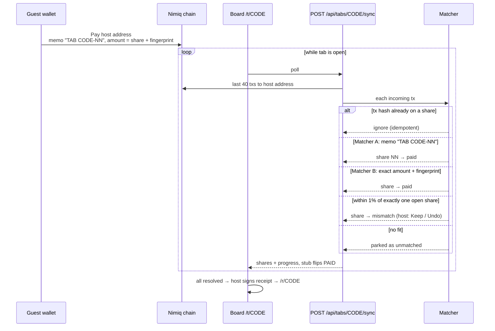
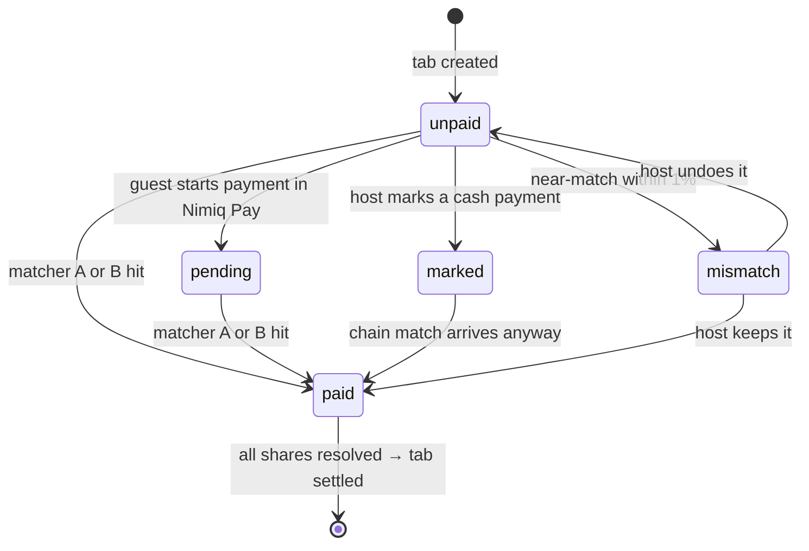

# Tab

Split a restaurant bill into instant, feeless NIM payment requests. Settled before you leave the table, with a signed receipt anyone can verify.

Live: https://gettab.vercel.app · Built for the [Nimiq Mini Apps Competition](https://miniappscompetition.com)

> [!NOTE]
> Default network is **testnet**. Set `NEXT_PUBLIC_NIMIQ_NETWORK=mainnet` for production.

## What is it?

Tab is a Nimiq Pay mini app with three parts at one table:

1. **Host** opens Tab inside Nimiq Pay, types the total, picks the people count, taps **Split it**. Nimiq Pay is required for the host only.
2. **Guests** scan the QR and pay the host's address from any NIM wallet. One tap inside Nimiq Pay, or address + memo + QR from anywhere else. No account, no install required.
3. **Receipt** — when every share is paid, the host signs a settlement receipt. The `/r/CODE` page verifies the signature independently with `@nimiq/core`.

Tab never holds funds. Money moves wallet to wallet; Tab only watches the chain and keeps score.

| Route | Job |
|---|---|
| `/` | Create a tab |
| `/t/CODE` | Live board, stubs flip to PAID |
| `/t/CODE/qr` | Full-screen QR for the table |
| `/p/CODE-NN` | One guest's pay page |
| `/r/CODE` | Signed, verifiable receipt |

## How it works



The board polls the sync endpoint, which reads recent transfers to the host's address from chain history and runs each one through the matcher.

## Core logic: how a payment becomes PAID

Every share's payable amount is its base amount plus a tiny unique **luna fingerprint**. That is the trick the whole matcher rests on: even when a wallet strips the memo, the amount alone still identifies exactly one share.



Each share moves through a small state machine; the tab itself is `open → settled` (or `expired` after 24h, when it refuses new payments):



Matching is idempotent (a transaction hash settles a share once), pure (`lib/nimiq/match.ts` has no DB imports and is unit-testable), and conservative: anything ambiguous becomes a host decision instead of a silent guess.

## Why Nimiq

The product depends on one property: a transfer that is instant (~1s) and feeless. On card rails a $7 share loses 3% + $0.30; on most chains gas eats the split. NIM is the reason "settled before you leave the table" is a literal description and not copy.

## Who it's for

Groups of 3–8 friends who eat out together, flatmates, small trip groups. The host is the only person who needs Nimiq Pay — every tab invites up to seven people who may not have it yet, which is the distribution mechanic.

Rough market: the Splitwise class of bill-splitting apps serves tens of millions of users, and all of them stop at *recording* the debt. Tab clears it. Revenue model: free for NIM splits, permanently; a possible future 0.5% convenience fee on a USDT path, and a paid teams mode for recurring group expenses. None of that is built today.

## Quick start

```bash
npm install
cp .env.example .env.local   # already defaults to testnet
npm run dev
```

Open `http://localhost:3000`.

Storage is optional locally: with `DATABASE_URL` set, tabs live in Postgres (`db/schema.sql`, Neon works out of the box); without it, in a local `.data/store.json`. Production needs `DATABASE_URL`.

### Testnet in Nimiq Pay

1. Long-press **Settings** for ~10 seconds to enable the hidden menu
2. Switch network to **Testnet**
3. Tap **Get free NIM** on the home / top-up screen (~110k test NIM)
4. Load the mini app — local URL or deployed ([guide](https://nimiq.dev/mini-apps/development/load-local-mini-app))

History polling uses `v2.test.nimiqwatch.com`; explorer links go to `test.nimiq.watch`.

## Configuration

| Variable | Required | Purpose |
|---|---|---|
| `NEXT_PUBLIC_NIMIQ_NETWORK` | no | `testnet` (default) or `mainnet` |
| `DATABASE_URL` | in production | Postgres connection string (`db/schema.sql`); omit locally to use the JSON store |
| `NIMIQ_RPC_URL` | no | JSON-RPC override; mainnet default is `https://rpc.nimiqwatch.com` |
| `NEXT_PUBLIC_APP_URL` | no | Canonical URL for Open Graph links |

## Limits

| Limit | Honest state |
|---|---|
| Audit | Unaudited |
| Tokens | NIM only, no USDT yet |
| Network | Testnet by default; mainnet is an env switch |
| Tab lifetime | Expires in 24h |
| Cash marks | Host-asserted, not chain-verified |
| Mismatched payments | Host Keep / Undo only |
| FX display | Live NIM/USD rate even on testnet; test NIM has no market value |
| Local store | `.data/` is single-process — set `DATABASE_URL` (Postgres) in production |

## Roadmap

1. Ship `lib/nimiq/` (provider adapter, matcher, signed receipts) as a package
2. USDT path with an honest fee
3. Bill photo → total
4. Per-dish split
5. Stamped: seller receipts built on the same signature module
6. Public tab counter

## Development

```bash
npm run lint        # eslint
npx tsc --noEmit    # typecheck
npm run build       # production build
```

Competition rubric mapping: [`docs/criteria.md`](docs/criteria.md)

## License

MIT
