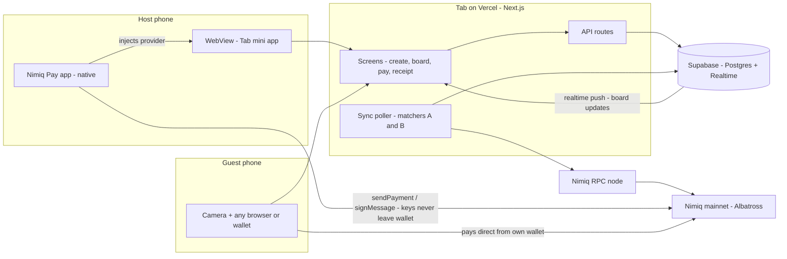
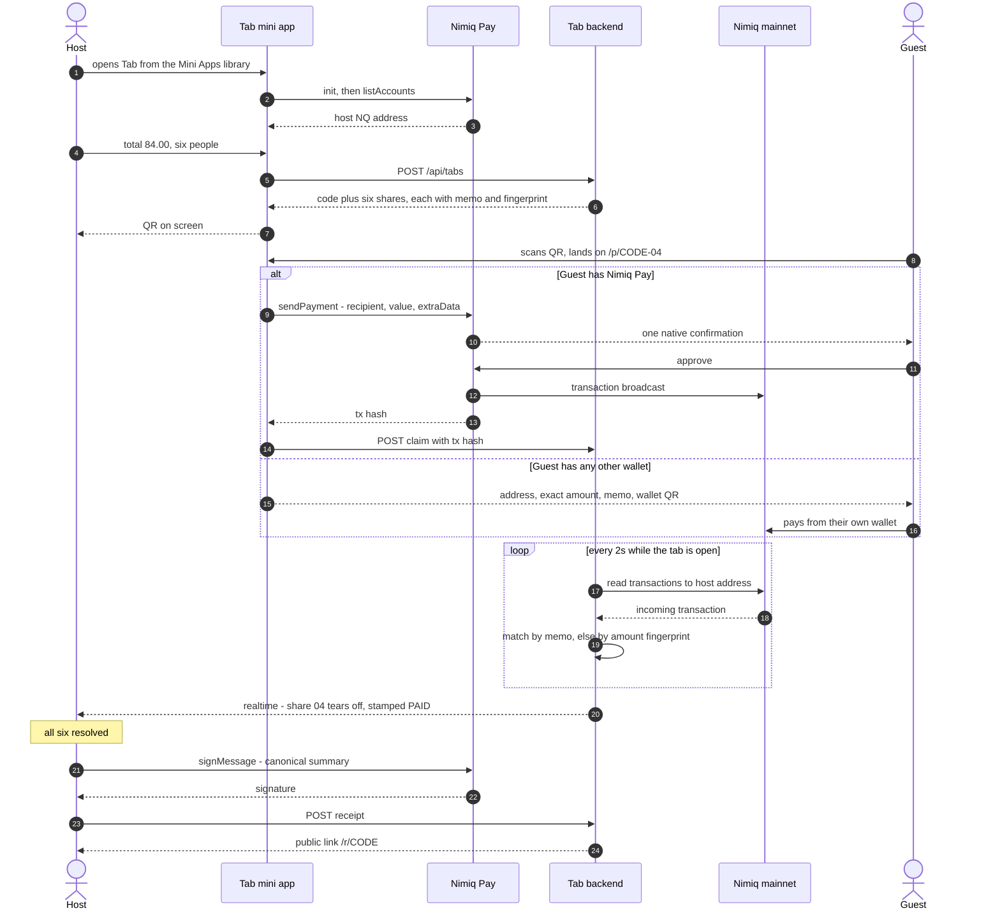
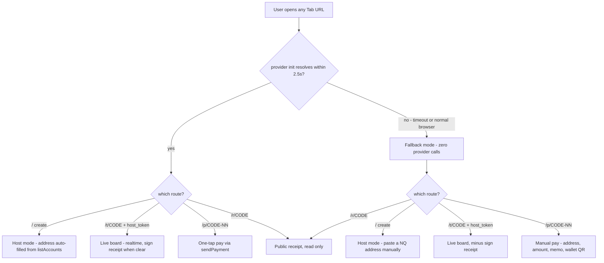
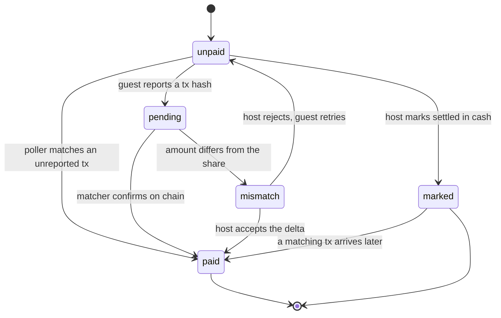
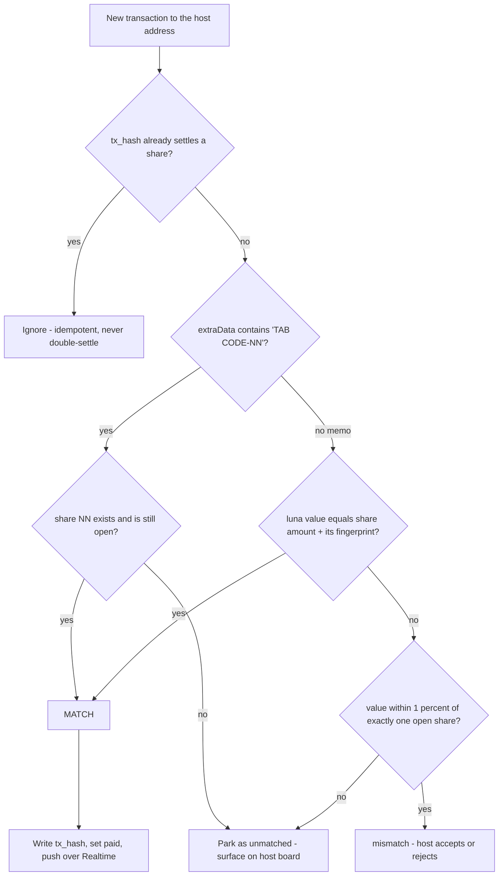
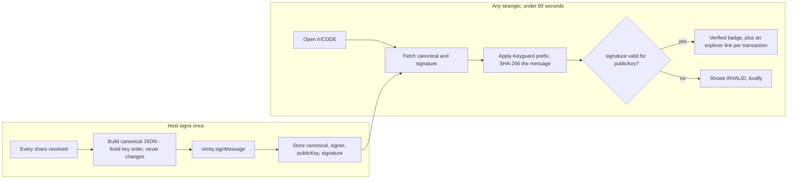
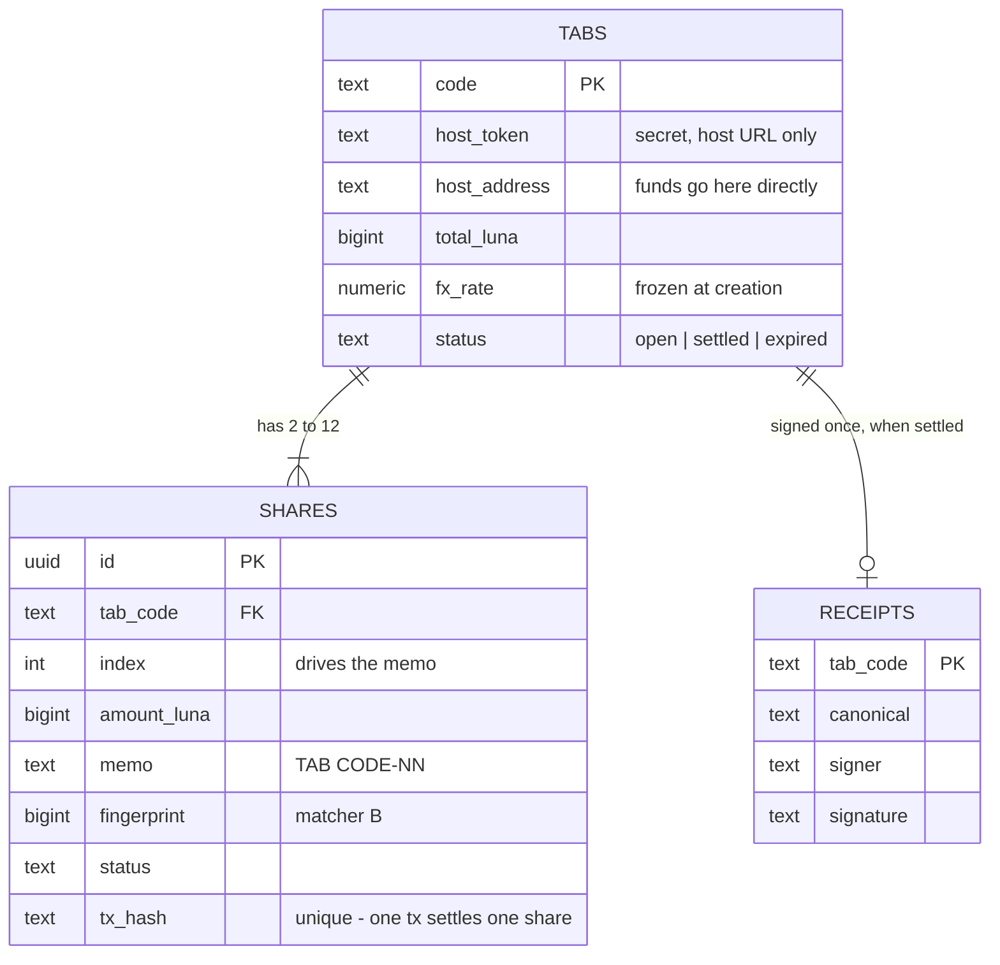
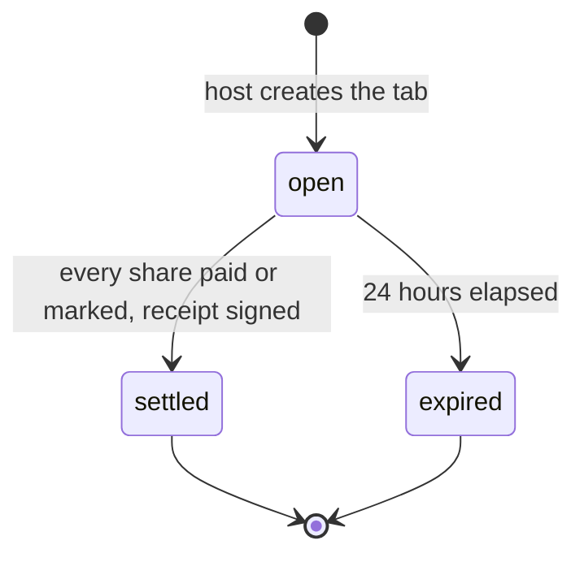

# Tab — Product Requirements Document

**Split a real bill in person. Settled before you leave the table.**

Nimiq Pay Mini App · Nimiq Mini Apps Competition
Version 1.0 · Owner: Kaizen (@fozan) · Status: ready to build

---

## 0. HOW TO USE THIS FILE (read this first, coding agent)

This is the single source of truth. Build exactly what is in here. Do not add features that are not in here. Anything not in scope is listed in §4 (Non-goals) — if you find yourself building it, stop.

**Before writing any code, do these three things:**

1. **Install the Nimiq docs skill / MCP server for your agent.** Nimiq publishes AI-agent-oriented documentation plus a Nimiq MCP server that exposes the Developer Center. Connect it. It exists specifically so agents stop guessing at API shapes.
2. **Verify every API signature in §7 against the live docs at `https://nimiq.dev/mini-apps`.** The signatures below are correct as of the framework launch, but the framework is young and endpoints are being added. Where this PRD says `⚠️ VERIFY`, you must check the docs before using it — do not invent a method name.
3. **Read `https://miniappscompetition.com/rules` and paste the judging criteria into `docs/criteria.md` on day one.** They are also summarised in §1.

**Build order is §14. Follow it in order.** The golden path (§3) must be clickable end to end before anything is styled.

---

## 1. THE COMPETITION FRAME (why every decision below is what it is)

Scoring is 105 points across four equal blocks plus a bonus. Design is worth exactly as much as functionality. Marketing is worth exactly as much as functionality. Most entrants will spend 95% of their time on functionality and lose.

| Block | Pts | What Tab does about it |
|---|---|---|
| Design & UX | 25 | Native-feeling inside Nimiq Pay, zero-to-first-split in under 60s, no instructions needed, no account creation |
| Functionality | 25 | Real NIM settlement on mainnet, works first try, no mockups anywhere |
| Usefulness & originality | 25 | Solves a universal weekly problem; the signed settlement receipt is the original part |
| Marketing & distribution | 25 | Real users at real tables, video of an actual restaurant bill, launch thread, Skool + Forum presence |
| Community bonus | 5 | Weekly Sip & Ship attendance, public build log |

**Hard rules from the competition (non-negotiable):**
- Must integrate with Nimiq Pay and support USDT, NIM, or both. **Supporting NIM earns bonus points** → Tab is NIM-first.
- Displaying a Nimiq logo alone does not count as integration.
- Must be **fully functional and usable on the first try. No prototypes or mockups.** Every screen must be real.
- No hardcoded private keys, API secrets, or credentials in the repo. Run a secrets scan before every push.
- Public GitHub repo linked to the submission.

---

## 2. PRODUCT DEFINITION

### 2.1 One sentence
Tab turns a restaurant bill into a set of instant, feeless payment requests your friends can settle in one tap — and hands you a signed receipt proving everyone paid.

### 2.2 The problem (stated the way it actually happens)
Six people eat. One person's card pays. That person now owns an unpaid debt spread across five friends, and asking for it costs social capital. Existing splitters (Splitwise et al.) are ledgers — they *record* the debt, they don't *clear* it. Bank transfers take a day and need account details. Card-based apps take a cut that is absurd on a $7 share and mostly don't work across borders.

- **Desire:** save time, and avoid the status cost of chasing friends.
- **Root problem:** there is no way to move $7 between two phones instantly, for free, without either party onboarding into anything.
- **Pain: 8/10.** Universal, recurring weekly, and currently unsolved for anyone whose friends aren't all on the same domestic payment app.

### 2.3 Why this is impossible without Nimiq
The whole product depends on a transfer that is **instant (~1s) and feeless**. On card rails a $7 split loses 3% + $0.30 to fees, which is why nobody built this. On most chains the gas eats the split. NIM is feeless and confirms in about a second, which is the only reason "settled before you leave the table" is a true sentence and not marketing copy.

This survives the skeptic test: *"couldn't you do this with Stripe + Postgres?"* No — Stripe's per-transaction floor makes sub-$10 splits uneconomic, and it requires both parties to hold accounts in supported countries.

### 2.4 Target user (never "everyone")
Primary: groups of 3–8 friends aged 20–35 who eat out together and already have at least one crypto-curious member. Secondary: flatmates splitting a shared bill; small tour/trip groups splitting a booking.

The host is the only person who needs Nimiq Pay. That constraint is the product's whole distribution mechanic — see §11.

### 2.5 Revenue model (for the README, not for v1)
Free for splits. Charge nothing on NIM. Optional future: a 0.5% convenience fee on the USDT path only, and a paid "Tab for teams" mode for recurring group expenses. Do not build any of this now.

---

## 3. THE GOLDEN PATH (this is the demo; it must work perfectly)

This single flow, end to end, is the product. Everything else is stretch.

```
HOST (inside Nimiq Pay)                 GUEST (any phone, any wallet)
────────────────────────                ─────────────────────────────
1. Opens Tab from Mini Apps
2. Types total: 84.00 (in local fiat)
3. Taps "6 people"  → 14.00 each
   (or drags to set uneven shares)
4. Taps "Create tab"
   → 6 payment stubs generated
5. Shows QR on screen                   6. Scans QR with phone camera
                                        7a. Has Nimiq Pay → opens Tab,
                                            one tap, approves, paid
                                        7b. No Nimiq Pay → web page with
                                            address + memo + QR, pays
                                            from any wallet
8. Board flips that stub to PAID
   within ~1 second, haptic + sound
9. When all 6 are green: host taps
   "Sign receipt"
10. Signed settlement receipt link,
    shareable to the group chat
```

**Timing target: host from cold open to QR on screen in under 25 seconds. Guest from scan to paid in under 15 seconds.**

---

## 3.5 CORE LOGIC — DIAGRAMS

Seven diagrams, in Mermaid so they render on GitHub. Diagram 1 is the architecture diagram the submission checklist requires (§15). If your implementation ever disagrees with one of these, the diagram is wrong — fix the diagram in the same commit.

### D1 — System architecture



Read one thing off this diagram: **no arrow carries money into Tab.** Guests pay the host's address directly. Tab only ever reads the chain.

### D2 — Golden path, end to end



### D3 — Entry routing (why the app never shows a blank screen)



A judge opening your link on a laptop hits the right-hand branch. It must be a working product, not an apology.

### D4 — Share state machine



`marked` and `paid` are never drawn the same way in the UI, and the signed receipt keeps them distinct. One is a claim, the other is a fact.

### D5 — Payment matching (the algorithm the demo lives or dies on)



Matcher A is the memo. Matcher B is the amount fingerprint, which is what saves you when a third-party wallet strips the memo. Build both on day 1 and test them with real mainnet transactions before any UI exists.

### D6 — Signed receipt: produce and verify



This is the originality lift and the trust twist in one component. It is also the module the next project reuses, so keep it in `lib/nimiq/receipt.ts` with no imports from the Tab UI.

### D7 — Data model



### D8 — Tab lifecycle



---

## 4. NON-GOALS (do not build these)

- ❌ User accounts, login, passwords, email
- ❌ Receipt OCR / camera scanning of the paper bill (v2 — it breaks on the demo)
- ❌ Itemised per-dish assignment (v2; uneven *amounts* are in scope, per-item is not)
- ❌ Multi-currency conversion beyond a single fiat display currency
- ❌ Push notifications
- ❌ Settings screen, profile screen, dark-mode toggle (respect system, no toggle)
- ❌ Group history / friends list / social graph
- ❌ Any admin dashboard
- ❌ Any logging/analytics beyond a single anonymous counter (see §12)
- ❌ Chat, comments, emoji reactions on the tab

If a feature is not needed to walk the golden path, it does not exist in v1.

---

## 5. USER STORIES + ACCEPTANCE CRITERIA

**US-1 — Create a tab**
As the person who paid the bill, I enter a total and a number of people and get shareable payment requests.
- ✅ Total accepts fiat input with two decimals; live NIM equivalent shown beneath
- ✅ People count 2–12 via a stepper; default split is even to the cent, remainder cents assigned to the host
- ✅ Tab is created and QR displayed in ≤2 taps after entering the total
- ✅ Tab code is 6 characters, unambiguous alphabet (no 0/O/1/I/l)

**US-2 — Uneven shares**
As the host, I can give people different amounts because Ade only had a drink.
- ✅ Each stub's amount is editable inline; a running "unassigned" remainder is always visible
- ✅ Cannot create tab while remainder ≠ 0; the CTA states why it's disabled
- ✅ Editing one share never silently changes another

**US-3 — Pay as a Nimiq Pay user**
As a guest with Nimiq Pay, I pay my share in one tap.
- ✅ Deeplink opens Tab inside Nimiq Pay directly on my stub
- ✅ Exactly one native confirmation dialog, pre-filled with recipient, amount, memo
- ✅ On approval the board updates in ≤3s and my stub shows my tx hash

**US-4 — Pay as a non-Nimiq user**
As a guest with no Nimiq Pay, I can still pay without installing anything I don't want.
- ✅ Web fallback page renders the host's address, exact amount, memo, and a scannable QR usable by any Nimiq wallet
- ✅ One-tap copy for address, amount, memo, each with visible confirmation
- ✅ A clear, honest "Get Nimiq Pay" secondary action — never a blocking wall

**US-5 — Live board**
As the host, I watch shares turn green without refreshing.
- ✅ Board updates within 3s of on-chain confirmation, no manual refresh
- ✅ Each paid stub shows payer label, amount, timestamp, and a link to the block explorer
- ✅ Board survives a page reload and a network drop, then re-syncs

**US-6 — Cash / already-paid**
As the host, I can mark a share settled outside the app so the tab can close.
- ✅ "Marked by host" state is visually distinct from "Paid on-chain" and labelled as unverified
- ✅ The signed receipt reflects the distinction honestly

**US-7 — Signed settlement receipt** *(the originality lift)*
As the host, when the tab clears I get a proof I can share.
- ✅ Host signs a canonical JSON summary with `signMessage`
- ✅ Public receipt page shows every share, tx hash, signature, signer address, verified badge
- ✅ Anyone can independently verify the signature from the page in under 60 seconds
- ✅ Receipt page has an OG image so it previews in group chats

---

## 6. TECH STACK

Chosen for shipping speed, not novelty. Do not swap anything.

| Layer | Choice | Why |
|---|---|---|
| Framework | **Next.js 15 (App Router) + TypeScript** | One deploy for mini app + fallback page + receipt page |
| Styling | **Tailwind CSS v4** with Nimiq-derived tokens (§9) | Fast, and tokens keep it native-feeling |
| DB + realtime | **Supabase** (Postgres + Realtime) | Live board with no websocket code |
| Hosting | **Vercel** | Instant HTTPS origin, required for the mini app URL |
| QR | `qrcode` (generate) | Fallback page + host screen |
| Chain reads | Nimiq RPC via server route | Confirming payments |
| EVM (optional) | `viem` | USDT-on-Polygon secondary path |

### 6.1 Dependencies — install these

```bash
# Nimiq — required
npm i @nimiq/mini-app-sdk        # mini app provider: init(), requestDeviceIdentifier()
npm i @nimiq/core                # ⚠️ VERIFY package name for the Albatross web client;
                                 #    older docs reference @nimiq/core-web
npm i @nimiq/utils               # address validation, fiat API, currency formatting

# Nimiq — optional but boosts the "feels native" design score
npm i @nimiq/style               # official Nimiq CSS variables/components

# App
npm i next react react-dom
npm i @supabase/supabase-js
npm i qrcode
npm i zod                        # validate every API payload
npm i nanoid                     # tab codes + host tokens

# Optional, only if you build the USDT path
npm i viem
```

`⚠️ VERIFY` — server-side Nimiq RPC client: check the Developer Center's RPC section for the current recommended TS client before adding a package. If none is recommended, call the JSON-RPC endpoint with `fetch` — it is a handful of methods and that is fine.

---

## 7. NIMIQ INTEGRATION SPEC

**This is the load-bearing section. Judges score integration depth, and "displaying a logo does not count."** Tab wires in five distinct pieces of the framework.

### 7.1 What we use and why it is load-bearing

| Framework capability | Where it sits in Tab | Load-bearing? |
|---|---|---|
| Mini App SDK `init()` + provider readiness | App boot, host detection | Yes — gates the whole host flow |
| `listAccounts()` | Auto-fills the host's receiving address, so the host never types an address | Yes |
| `sendBasicTransactionWithData()` | Guest pays their share (was incorrectly named `sendPayment` in earlier drafts) | Yes — the money path |
| `sign()` | Host signs the settlement receipt (was incorrectly named `signMessage` in earlier drafts) | Yes — the trust path |
| `isConsensusEstablished()` / `getBlockNumber()` | Payment confirmation + an honest "syncing" state | Yes |
| `requestDeviceIdentifier()` | Anti-spam on tab creation, and "your tabs" without accounts | Yes |
| `window.nimiqPay.language` | UI language, matching the user's Nimiq Pay setting rather than device locale | Supporting |
| `window.ethereum` | USDT-on-Polygon secondary path | Optional |
| `nimiqpay://miniapp?url=` deeplink | Guest entry from the QR | Yes — the distribution path |

**Sponsor KPI this grows:** Nimiq Pay installs and NIM transaction count. Every tab creates up to 11 outbound payment requests aimed at people who do not yet have the app. State this explicitly in the README — the judges are Nimiq people who must justify the pick internally.

### 7.2 Provider boot

```ts
// lib/nimiq/provider.ts
import { init } from '@nimiq/mini-app-sdk'

export type NimiqCtx = Awaited<ReturnType<typeof init>>

let cached: NimiqCtx | null = null

/** Resolves the provider, or null when we are NOT inside Nimiq Pay. */
export async function getNimiq(timeoutMs = 2500): Promise<NimiqCtx | null> {
  if (cached) return cached
  try {
    cached = await Promise.race([
      init(),
      new Promise<null>((r) => setTimeout(() => r(null), timeoutMs)),
    ]) as NimiqCtx | null
    return cached
  } catch {
    return null
  }
}

export const isInsideNimiqPay = async () => (await getNimiq()) !== null
```

**Rule: the app must never break outside Nimiq Pay.** Opened in a normal browser, Tab renders the fallback experience. The judge who opens your link on a laptop must see something that works, not a blank screen waiting on a provider.

### 7.3 Reading the host's account

```ts
const nimiq = await getNimiq()
const accounts = await nimiq!.listAccounts()
// Live docs (2026-07-29): returns string[] of user-friendly addresses
const hostAddress = accounts[0]
```

### 7.4 Sending a payment

Verified against https://nimiq.dev/mini-apps/api-reference/nimiq-provider — use **`sendBasicTransactionWithData`** (there is no `sendPayment`).

```ts
const txHash = await nimiq.sendBasicTransactionWithData({
  recipient: tab.host_address,       // human-readable NQ.. address
  value: shareLuna,                  // integer luna; 1 NIM = 100_000 luna
  data: memo,                        // e.g. "TAB 7QF3M2-04"  (see §7.6)
})
// txHash → string. Persist it immediately; do not rely on the board to catch it.
```

Nimiq Pay shows its own native confirmation. **Do not build a second confirmation screen** — one confirmation, native, is the entire UX advantage.

### 7.5 Signing the settlement receipt

Verified — method is **`sign`**, not `signMessage`.

```ts
const canonical = /* fixed key-order JSON — see lib/nimiq/receipt.ts */

const signed = await nimiq.sign(canonical)
// → { publicKey: string, signature: string }  (hex)
```

Store `canonical`, `signer` (from listAccounts), `public_key`, `signature`. The public receipt page re-derives and verifies. Nimiq's Keyguard prefixes data before signing, so verification must apply the same prefix — follow the Hub API "Sign Message" verification snippet exactly.

### 7.6 Payment matching — the part that decides whether this works

We are non-custodial. Guests pay the **host's own address** directly; Tab never holds funds. Say this in the README, it is a trust win.

That creates one hard problem: *which incoming transaction is which share?* Solve it with two matchers, in order:

**Matcher A — memo (primary).** Each share gets a unique memo written to `extraData`: `TAB <CODE>-<NN>`. A server poller reads recent transactions to the host address and matches on memo. Deterministic.

**Matcher B — amount fingerprint (fallback).** If `extraData` is unavailable on the guest's path, add a per-share sub-unit fingerprint to the amount: share 4 of tab X pays `14.00 NIM + 0.00004 NIM`. Unique within a tab, invisible in fiat, matches on exact luna value. This also covers guests paying from third-party wallets that drop memos.

Implement **both**. Ship with A primary, B automatic. This is the single most likely place for the demo to fail, so build it on day 1 and test with real mainnet transactions of ~1 NIM before building any UI.

**Poller design:** one server route polls the Nimiq RPC for transactions to each open tab's host address every 2s while the tab is open (long-poll or cron + Supabase Realtime push). Match → write `tx_hash`, flip status to `paid`, Realtime pushes to the host board. Idempotent: a given tx hash may only settle one share, ever.

### 7.7 The deeplink

```
nimiqpay://miniapp?url=tab.<yourdomain>/p/<CODE>-<NN>
```

The QR the host displays encodes a **normal https URL**, not the deeplink. Reason: a plain camera scan must work for someone with no Nimiq Pay. That https page detects Nimiq Pay and offers the deeplink; if the user is already inside Nimiq Pay, it routes straight to the one-tap flow.

### 7.8 USDT on Polygon (optional, only if days remain)

Via `window.ethereum`: standard ERC-20 `transfer` to the host's EVM address. Client reports the tx hash; a server route verifies the `Transfer` log with `viem`. Gate this behind a toggle on the create screen and label it plainly. **Do not start this until the NIM path is completely finished** — NIM is what earns bonus points.

---

## 8. DATA MODEL

```sql
create table tabs (
  code            text primary key,              -- 6 chars, unambiguous alphabet
  host_token      text not null,                 -- secret, in the host's URL only
  host_address    text not null,                 -- NQ.. address, funds go direct
  host_device_id  text,                          -- from requestDeviceIdentifier
  currency        text not null default 'USD',
  total_luna      bigint not null,
  fx_rate         numeric not null,              -- fiat per NIM, frozen at creation
  title           text,                          -- e.g. "Dinner at Mama's"
  status          text not null default 'open',  -- open | settled | expired
  created_at      timestamptz not null default now(),
  expires_at      timestamptz not null           -- created_at + 24h
);

create table shares (
  id           uuid primary key default gen_random_uuid(),
  tab_code     text not null references tabs(code) on delete cascade,
  index        int not null,                     -- 1..12, drives the memo
  label        text,                             -- "Ade", optional, guest-editable
  amount_luna  bigint not null,
  memo         text not null,                    -- "TAB 7QF3M2-04"
  fingerprint  bigint not null,                  -- luna suffix for matcher B
  status       text not null default 'unpaid',   -- unpaid | pending | paid | marked
  tx_hash      text unique,
  paid_at      timestamptz,
  unique (tab_code, index)
);

create table receipts (
  tab_code   text primary key references tabs(code) on delete cascade,
  canonical  text not null,
  signer     text not null,
  public_key text not null,
  signature  text not null,
  created_at timestamptz not null default now()
);
```

**Invariants:**
- `sum(shares.amount_luna) == tabs.total_luna` — enforce in a DB constraint or a transaction, never only in the UI.
- A `tx_hash` settles exactly one share. Unique index does the work.
- `fx_rate` is frozen at creation. Nobody's share changes because the price moved during dinner.
- Tabs expire after 24h. An expired tab's payment pages say so plainly and stop accepting.

**Security:** `host_token` is the only thing separating a host from a guest. It lives in the host's URL and in `sessionStorage`, is never rendered on a guest page, and never appears in the QR. All host-only routes check it server-side.

---

## 9. DESIGN SPEC

25 points. Treat this section as seriously as the payment logic.

### 9.1 Direction
The subject is a **paper receipt** — the physical artifact this whole product replaces. Tab is a receipt that pays itself. The interface is a single continuous receipt strip; each person is a stub on that strip, separated by perforated tear lines. Paying tears a stub off. That is the signature and the one place to spend boldness — everything else stays quiet.

Avoid the AI-design defaults: no cream background with a serif display and a terracotta accent, no near-black with an acid-green accent, no broadsheet hairline grid.

### 9.2 Tokens

```css
--ink:        #1F2348;  /* Nimiq blue — primary text and the receipt's ink */
--paper:      #FBFAF7;  /* off-white receipt stock, warm but not cream */
--paper-edge: #EFEAE0;  /* perforation and tear shadows */
--gold:       #E9B213;  /* Nimiq gold — CTA only, never decoration */
--gold-hot:   #FC8702;  /* gradient end, used once, on the pay button */
--paid:       #21BCA5;  /* Nimiq green — settled */
--alert:      #D94432;  /* Nimiq red — errors only */
```

Dark mode: invert to `--ink` ground with `--paper` text; the receipt becomes a thermal-printer negative. Respect the system setting, no toggle.

### 9.3 Type
- **Amounts and the tab code:** a monospaced face with real character — `Space Mono` or `JetBrains Mono`. Money on a receipt is monospaced; this is true to the subject and it makes digits align down the strip.
- **Everything else:** `Inter` (or Nimiq's own `Muli`, if you use `@nimiq/style`). Body 16px minimum — this is read at a dim restaurant table.
- Type scale: 13 / 16 / 20 / 32 / 56. The 56 is only the total.

### 9.4 Layout rules
- Single column, max 480px, centred. Thumb-first: every primary action sits in the bottom third.
- Tap targets 48px minimum.
- The receipt strip scrolls; the CTA is fixed to the bottom with a safe-area inset.
- One screen, one job. No tabs, no hamburger, no nav bar.

### 9.5 Motion
Exactly one orchestrated moment: **when a share is paid, the stub tears off** — a 400ms clip-path tear along the perforation, the stub falls slightly and settles with a green ink stamp reading PAID, with a short haptic. Everything else is a 150ms opacity/transform. Respect `prefers-reduced-motion`: skip the tear, cross-fade the stamp.

### 9.6 Copy rules
Active voice, sentence case, plain verbs. The button says what happens: **"Pay 14.00"**, not "Submit". Errors state what happened and the fix, and never apologise: *"That payment didn't land. Check you sent the exact amount, including the memo."* The empty state is an invitation: *"What did it come to?"*

### 9.7 Screens (all of them)

1. **`/` Create** — total input (fiat, big, monospace), NIM equivalent underneath, people stepper, "Create tab". Nothing else.
2. **`/t/<CODE>` Board (host)** — receipt strip of stubs, live status per stub, big QR button, "N of 6 settled" progress, "Sign receipt" appears only when all stubs are resolved.
3. **`/t/<CODE>/qr` QR** — full-screen QR, max brightness request, tab code in huge monospace as a spoken fallback.
4. **`/p/<CODE>-<NN>` Pay (guest)** — amount, who's asking, one button. Inside Nimiq Pay: "Pay 14.00". Outside: address + amount + memo, each copyable, plus a wallet QR.
5. **`/r/<CODE>` Receipt (public)** — the settled strip, signature block, verify button, share button.

Five screens. Not six.

---

## 10. API ROUTES

All payloads validated with `zod`. All host routes require `host_token`.

| Route | Method | Purpose |
|---|---|---|
| `/api/tabs` | POST | Create tab + shares. Returns `code`, `host_token` |
| `/api/tabs/[code]` | GET | Public tab state (never returns `host_token`) |
| `/api/tabs/[code]/shares/[i]` | PATCH | Host: edit amount/label. Guest: set own label only |
| `/api/tabs/[code]/shares/[i]/mark` | POST | Host: mark settled in cash. Host token required |
| `/api/tabs/[code]/claim` | POST | Guest reports a tx hash after paying from a third-party wallet |
| `/api/tabs/[code]/sync` | POST | Poll Nimiq RPC, run matchers A and B, settle shares. Idempotent |
| `/api/tabs/[code]/receipt` | POST | Store the signed receipt |
| `/api/receipts/[code]` | GET | Public receipt + verification data |

Rate-limit `POST /api/tabs` by `host_device_id` and IP: 20 tabs/hour.

---

## 11. THE DISTRIBUTION MECHANIC (25 points — build it in, don't bolt it on)

Every tab is an invitation aimed at 5 people who probably don't have Nimiq Pay yet. The fallback page is therefore a **product surface, not an error state**. It must:

- Let a non-Nimiq guest pay successfully from any Nimiq wallet, no install, no friction
- Show, after they pay, one honest line: *"That took 1 second and cost nothing. Nimiq Pay does this in one tap."* with a store link
- Never block, never modal-trap, never guilt

Ship these too:
- **OG images** on `/p/` and `/r/` so links preview properly in WhatsApp and group chats
- **Web Share API** on the host board — "Send to the group chat" beats "show my QR" for remote splits
- **A real named tab in the demo** — "Dinner at Mama's", not "Test Tab 3"

---

## 12. PRIVACY, HONESTY, AND WHAT WE DON'T DO

- No accounts, no email, no name required. Labels are optional and local.
- `requestDeviceIdentifier` is called with a clear reason string: *"So your tabs stay on this device."* Nothing else uses it.
- No analytics beyond one anonymous counter of tabs created. Say this in the README.
- Funds never touch us. Guests pay the host's address directly. **Say this on the pay screen**, in plain words — it is the trust argument.
- The README carries an honest limits table: unaudited, mainnet NIM only, 24h expiry, no dispute resolution, cash-marked shares are unverified by definition.

---

## 13. FAILURE MODES AND EDGE CASES

Handle every one of these. Judges click exactly these things.

| Case | Behaviour |
|---|---|
| Opened outside Nimiq Pay | Full fallback experience. Never a blank screen |
| Provider never resolves | 2.5s timeout → fallback. No infinite spinner |
| Consensus not established | Honest banner: "Syncing with the Nimiq network…" and the amount stays visible |
| Guest pays the wrong amount | Show as pending-mismatch with the delta; host can accept or reject |
| Guest pays twice | Second tx surfaces as an overpayment on the board; never silently swallowed |
| Guest drops the memo | Matcher B catches it via the amount fingerprint |
| Two guests pay identical amounts | Fingerprints differ by share index, so they can't collide |
| Tab expired | Payment page refuses politely and explains |
| Offline mid-flow | Cached board renders with a "last synced" timestamp; queue nothing, just be honest |
| Host closes the app | Board is server-state; reopening the host URL restores it |
| Rounding | Even splits round to the cent; the remainder always goes to the host, stated in the UI |
| FX moves mid-dinner | `fx_rate` frozen at creation. Never recompute |

---

## 14. BUILD ORDER

**Day 1 — the money path, no UI.**
Verify §7 signatures against live docs. Get `init()`, `listAccounts()`, `sendPayment()`, `signMessage()` working in a throwaway page inside real Nimiq Pay. Send a real 1 NIM mainnet transaction with a memo and confirm your poller matches it. **Nothing else until this works.** If memos don't survive the round trip, matcher B becomes primary and you find that out today, not on submission day.

**Day 2 — golden path, unstyled.**
Schema, `/api/tabs`, create → board → pay → paid, with Supabase Realtime. Ugly is fine. End of day 2: a second phone can pay a share and the host board flips. *Golden path clickable end to end.*

**Day 3 — the guest fallback + receipt.**
`/p/` page for non-Nimiq wallets, copy buttons, wallet QR. `signMessage` receipt + public `/r/` page with working independent verification.

**Day 4 — design pass.**
Implement §9 fully. Receipt strip, tear animation, tokens, type, dark mode, empty and error states, 60-second onboarding check with someone who has never seen it.

**Day 5 — judge path + submission.**
README as pitch deck, architecture diagram, live URL, real mainnet tx hashes as proof, honest limits table, roadmap, `docs/criteria.md` mapping each rubric line to where it's satisfied. Secrets scan. Fresh-clone test in a clean directory.

**Day 6 — distribution.**
Record the demo at a real table with a real bill, in your own voice, no TTS, ≥720p, on YouTube (never Drive or Pages). Launch thread tagging Nimiq. Post in the Skool community and the Nimiq Forum. Attend the Sip & Ship call.

**Day 7 — real users.**
Get 10 real people through a real tab and screenshot it. The rubric explicitly rewards this and almost nobody will do it.

Time split, enforced: **50% build / 25% judge path + submission / 25% distribution.**

---

## 15. DEFINITION OF DONE

Do not submit until every box is true.

- [ ] A stranger installs nothing and completes a split in under 60 seconds
- [ ] Real mainnet NIM transactions settle live in the demo, with explorer links
- [ ] Works on iOS and Android inside Nimiq Pay, and in a desktop browser as fallback
- [ ] No mockups, no placeholder screens, no dead buttons anywhere
- [ ] No secrets in code, README, description, `.env`, or commit history — scanner run and clean
- [ ] README opens with what it does, not how it was built
- [ ] Architecture diagram present (mermaid is fine)
- [ ] Honest limits table present
- [ ] Post-hackathon roadmap, 5 bullets minimum
- [ ] Target user, rough TAM, one revenue model stated
- [ ] The why-this-tech sentence is in the README
- [ ] Setup instructions verified with a fresh clone in a clean directory
- [ ] Demo video ≤2 min, real device, own voice, on YouTube, watched start to finish after upload
- [ ] Launch thread published, Nimiq tagged
- [ ] Adversarial self-audit run: *"inspect this app and be brutally honest"* — and the findings fixed

---

## 16. WHAT COMPOUNDS AFTER SUBMISSION

- `lib/nimiq/` — the provider adapter, payment matcher, and signed-receipt module become a reusable package for the next build. This is the point: the next project starts half done.
- The signed-receipt primitive is the seed of **Stamped** (signed proof-of-payment receipts for sellers), which is the next mini app and the next competition cycle.
- Post-competition: keep the domain, keep the X account, ship one improvement a week, publish the tab counter.

---

## 17. PASTE-READY KICKOFF PROMPT

Give your coding agent this, with the PRD attached:

> You are building **Tab**, a Nimiq Pay mini app, from the attached PRD. Follow it exactly.
>
> Before writing code: connect the Nimiq MCP documentation server, and verify every API signature marked `⚠️ VERIFY` in §7 against https://nimiq.dev/mini-apps. If a signature in the PRD is wrong, correct it and tell me what changed.
>
> Then execute §14 Day 1 only: a throwaway page that boots the provider, lists accounts, sends a real NIM payment with a memo, signs a message, and a server poller that matches an incoming transaction by memo and by amount fingerprint. Prove it with a real mainnet transaction hash. Do not build any UI, any database, or any other screen until I confirm this works.
>
> Rules for the whole project: no feature that is not in the PRD; never leave a spinner without a timeout; the app must never break when opened outside Nimiq Pay; no secrets in the repo, ever.
